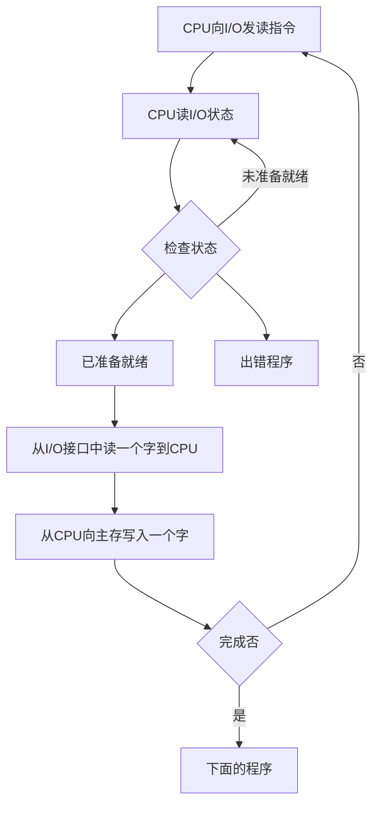

## 概述
### I/O系统的发展概述
1. 早期
    - 分散连接
    - CPU和I/O设备**串行**工作 程序查询方式(CPU必须运行某个程序查询I/O的输入和输出)
2. 接口模块和DMA阶段
    - 总线连接
    - CPU和I/O设备**并行**工作
        - 中断方式
        - DMA方式
3. 具有通道结构的阶段(通道相当于一个微处理器)
4. 具有I/O处理机的阶段
### I/O的组成
1. I/O软件
    - I/O指令(CPU指令的一部分)
    
    - 通道指令(通道自身的指令)
2. I/O硬件
    - 设备 I/O接口
    - 设备 设备控制器 通道
### I/O设备与主机的联系方式
1. I/O设备编址方式
    - 统一编址

        将内存和I/O设备一起编址 比如将高位给内存低位给I/O

        可以用取数、存数指令对内存和I/O进行操作
    - 不统一编址

        需要用专门的I/O指令对I/O设备操作
2. 设备选址

    用**设备选择电路**识别是否被选中(CPU给出的地址和设备自己保存的地址比较)
3. 传送方式
    - 串行
    - 并行
4. 联络方式
    - 立即响应(LED)
    - 异步工作采用应答信号
    
    - 同步工作采用同步时标
5. I/O设备与主机的连接方式
    - 辐射式连接(分散连接 每连接一个I/O就要由一条控制线和信号线)
    - 总线连接
### I/O设备与主机信息传送的控制方式
1. 程序查询方式

2. 程序中断方式

    
    :::info 栗子
    CPU正在执行我写的辣鸡程序
    ```python
        def callback(file):
            print(file)
        if __name__ == '__main__':
            print('开始了')
            ReadFile('USB1',callback)
            print('1')
            print('2')
            print('3')
    ```
    CPU先执行第一条print('开始了')向终端输出开始了

    然后执行ReadFile这个函数(CPU叫USB1启动然后准备数据)

    然后执行print('1')

    这个时候USB1准备好了数据CPU不执行print('2')了

    执行callback这个函数 并且将USB1的数据传进去执行print(file)

    执行完callback后再回来执行print('2')print('3')

    ::: 
3. DMA方式
    1. CPU执行一个I/O指令启动I/O设备(之后执行自己后面程序I/O不管了)
    2. DMA控制器控制I/O设备准备数据
    3. 准备好后DMA控制器发送一个请求占用总线(只需要一个存取周期 此时CPU不能访问主存)
    4. I/O和主存完成数据交换(这时CPU可以执行自己的程序)
    5. 完成存取

4. 比较


## I/O设备
1. 人机交互设备(键盘、鼠标、显示器等)
2. 计算机信息存储设备(磁盘、光盘等)
3. 机-机通信设备(调制解调器等)

## I/O接口
### 概述
**为什么要设置接口**
1. 实现设备的选择
2. 实现数据缓冲达到速度匹配(主机与I/O接口速度不匹配)
3. 实现数据串-并格式转换(可能主机到I/O是并行 I/O只能串行)
4. 实现电平转换(主机和I/O的工作电压不一致)
5. 传送控制命令
6. 反应设备的状态
### 接口的功能和组成
1. 总线连接方式的I/O接口电路

2. 接口的功能和组成

3. I/O接口的基本组成

## 程序查询方式
==程序流程==


==程序查询方式的接口电路==


::: info 将I/O设备的数据输入到主机(输入到主存的某个单元)
1. 主机给出地址线 设备选择电路将地址线和自己的端口号比对 有效则使SEL有效
2. 启动命令和SEL同时有效才启动设备
3. B有效 启动设备 设备准备数据
4. 设备准备好数据让4线置1(给主机发信号说已准备就绪) 数据传入到DBR寄存器
:::
## 程序中断方式
### 中断的概念
CPU在运行过程中若发生紧急事件 则停止当前任务 去完成紧急事件 当紧急事件完成再来完成当前任务
### I/O中断的产生

### 程序中断方式的接口电路
#### 配置中断请求触发器和中断屏蔽触发器 

::: info
1. 当I/O设备的数据准备好时 D完成触发器置1 
2. 当D置1和中断屏蔽触发器输出端Q非置1(没有被屏蔽)时INTR一端置1
3. CPU的中断查询信号输入INTR另一端
4. 发出中断请求
:::
#### 排队器
- 软件：[第八章](/computer/compose/)
- 硬件


::: info 
假设INTR2和INTR3发出中断请求

1. 除了INTR1和INTR2 后面所有的向上输出都是0

2. 这样就能找到INTP2
:::
#### 中断向量地址形成部件(找到中断服务程序入口地址)
- 软件：[第八章](/computer/compose/)
- 硬件

    由硬件产生向量地址 再由向量地址找到入口地址

    
    
    ::: details UnderStand
    假设一共由256个中断源 CPU自启动开始就无时无刻不在处理中断 所以得把中断服务程序放在内存一块固定的位置(称作中断向量表)(方便CPU寻找中断服务程序)

    在CPU启动时 取内存一块地方放中断向量表 所有每一个中断向量都由段地址(中断向量表的首地址)+偏移地址(向量相对于首地址的位置)

    :chestnut:

    假设中断向量表的地址是0101011  每一个向量(每一个中断源)占5位

    第一个中断源的地址就是010101+0=010101

    第二个中断源的地址是010101+5=011010 以此类推

    ---
    ---
    ---

    但是中断服务程序可能特别特别大也可能特别特别小 我们不能固定一块相同大小的内存存储程序(中断服务程序)

    所以我们在中断向量表里不存储程序 存储程序所在的地址

    :chestnut:

    假设第二个中断源发出了中断请求 CPU要执行第二个中断源的中断服务程序

    于是CPU先找到获得第二个中断源的中断向量 假设是10101+5=011010

    CPU到内存的011010这个地址上去看  因为中断向量表存储的是入口地址 于是CPU看到了1010111这个地址 于是CPU去1010111这个地址找到了程序 开始执行
    :::

#### 程序中断方式接口电路的基本组成


### I/O中断处理过程

### 中断服务程序流程
1. 保护现场
    - 程序断点的保护
    - 寄存器内容的保护 进栈
2. 中断服务

    对不同的I/O设备具有不同内容的设备服务
3. 恢复现场 出栈
4. 中断返回
## DMA方式
### DMA方式的特点
#### DMA和程序中断两种方式的数据通路

#### DMA与主存交换数据的三种方式
1. 停止CPU访问主存(在I/O通过DMA传输数据到主存时 CPU不能对主存访问 但是可以执行不访问主存的程序)
    - 控制简单
    - CPU处于不工作状态或保持状态
    - 未充分发挥CPU对主存的利用率

2. 周期挪用(周期窃取)

**DMA访问主存有三种可能**
- CPU此时不访存
- CPU正在访存
- CPU与DMA**同时请求访存**(CPU将总线控制权让给DMA)

3. DMA与CPU交替访问

### DMA接口的功能和组成
1. DMA接口功能
    1. 向CPU**申请**DMA传送
    2. 处理总线**控制权的转交**
    3. **管理**系统总线、**控制**数据传送
    4. **确定**数据传送的**首地址和长度** **修正**传送过程中的数据**地址**和**长度**
    5. DMA传送结束时，**给出操作完成信号**
2. DMA接口组成

### DMA工作过程
1. DMA传送过程
    1. 预处理
        - 通知DMA控制逻辑传送方向(入/出)
        - 设备地址-DMA的DAR
        - 主存地址-DMA的AR
        - 传送字数-DMA的WC
    2. DMA传送过程
    
    
    3. 数据传送过程(输入)

        
        1. 设备准备好数据后送入数据缓冲器BR
        2. 通过DREQ通知DMA控制逻辑数据准备好了
        3. DMA控制逻辑通过HRQ向CPU发出总线控制请求
        4. CPU通过HLDA给出应答并放弃总线占用
        5. AR给出地址线
        6. DMA控制逻辑通过DACK给设备应答信号(已经准备好传输数据)
        7. 通过数据线传输数据
        8. AR+1 WC+1
        9. 继续传输数据
        10. 传输完成后WC给出溢出信号给中断机构 中断机构发出中断请求开始后处理
    4. 输出过程类似
    5. 后处理

        校验送入主存的数是否正确
        是否继续使用DMA
        测试传送过程是否正确，错则转诊断程序
        (由中断服务程序完成)
2. DMA接口与系统的连接方式
    1. 具有公共请求线的DMA请求
    
    2. 独立的DMA请求
    
### DMA接口的类型
1. 选择型

    
    - 在**物理上**连接**多个**设备
    - 在**逻辑上**只允许连接**一个**设备
2. 多路型

    
    - 在**物理上**连接**多个**设备
    - 在**逻辑上**允许连接**多个**设备
3. 多路型DMA接口的工作原理

    
    假设磁盘、磁带、打印机分别占用DMA通道1、2、3 

    磁盘每隔30us发一次DMA请求 磁带每45us 打印机每150us

    打印机先发送DMA请求 T~2~周期磁盘和磁带同时发请求 DMA先为磁盘服务一个周期再为磁带服务一个周期  以此类推 