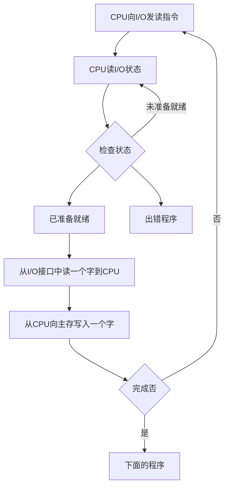

## 概述
### I/O系统的发展概述
1. 早期
    - 分散连接
    - CPU和I/O设备**串行**工作 程序查询方式(CPU必须运行某个程序查询I/O的输入和输出)
2. 接口模块和DMA阶段
    - 总线连接
    - CPU和I/O设备**并行**工作
        - 中断方式
        - DMA方式
3. 具有通道结构的阶段(通道相当于一个微处理器)
4. 具有I/O处理机的阶段
### I/O的组成
1. I/O软件
    - I/O指令(CPU指令的一部分)
    
    - 通道指令(通道自身的指令)
2. I/O硬件
    - 设备 I/O接口
    - 设备 设备控制器 通道
### I/O设备与主机的联系方式
1. I/O设备编址方式
    - 统一编址

        将内存和I/O设备一起编址 比如将高位给内存低位给I/O

        可以用取数、存数指令对内存和I/O进行操作
    - 不统一编址

        需要用专门的I/O指令对I/O设备操作
2. 设备选址

    用**设备选择电路**识别是否被选中(CPU给出的地址和设备自己保存的地址比较)
3. 传送方式
    - 串行
    - 并行
4. 联络方式
    - 立即响应(LED)
    - 异步工作采用应答信号
    
    - 同步工作采用同步时标
5. I/O设备与主机的连接方式
    - 辐射式连接(分散连接 每连接一个I/O就要由一条控制线和信号线)
    - 总线连接
### I/O设备与主机信息传送的控制方式
1. 程序查询方式

2. 程序中断方式
    
    :::info 栗子
    CPU正在执行我写的辣鸡程序
    ```python
        def callback(file):
            print(file)
        if __name__ == '__main__':
            print('开始了')
            ReadFile('USB1',callback)
            print('1')
            print('2')
            print('3')
    ```
    CPU先执行第一条print('开始了')向终端输出开始了

    然后执行ReadFile这个函数(CPU叫USB1启动然后准备数据)

    然后执行print('1')

    这个时候USB1准备好了数据CPU不执行print('2')了

    执行callback这个函数 并且将USB1的数据传进去执行print(file)

    执行完callback后再回来执行print('2')print('3')

    ::: 
3. DMA方式
    1. CPU执行一个I/O指令启动I/O设备(之后执行自己后面程序I/O不管了)
    2. DMA控制器控制I/O设备准备数据
    3. 准备好后DMA控制器发送一个请求占用总线(只需要一个存取周期 此时CPU不能访问主存)
    4. I/O和主存完成数据交换(这时CPU可以执行自己的程序)
    5. 完成存取

4. 比较


## I/O设备
1. 人机交互设备(键盘、鼠标、显示器等)
2. 计算机信息存储设备(磁盘、光盘等)
3. 机-机通信设备(调制解调器等)

## I/O接口
### 概述
**为什么要设置接口**
1. 实现设备的选择
2. 实现数据缓冲达到速度匹配(主机与I/O接口速度不匹配)
3. 实现数据串-并格式转换(可能主机到I/O是并行 I/O只能串行)
4. 实现电平转换(主机和I/O的工作电压不一致)
5. 传送控制命令
6. 反应设备的状态
### 接口的功能和组成
1. 总线连接方式的I/O接口电路

2. 接口的功能和组成

3. I/O接口的基本组成

## 程序查询方式
==程序流程==

## 程序中断方式
## DMA方式